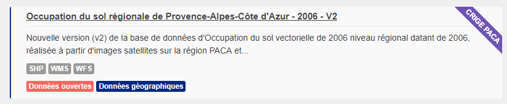
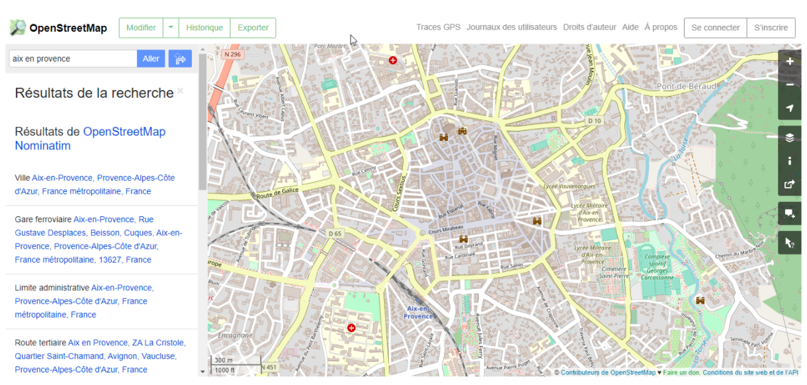

```{r load_packages, message=FALSE, warning=FALSE, include=FALSE} 
library(fontawesome)
```

class: center, middle, inverse
<!-- !! http://eduscol.education.fr/sti/sites/eduscol.education.fr.sti/files/ressources/pedagogiques/693/693-isn-opendatadocument-ressource-prof.pdf -->
<!-- !! licence ou licence ? -->

<!-- --- -->

# Le bestiaire des données

`r fa("sticker-mule", width = "4em")` 

Le biotope des données comprend des individus assez particuliers

---
class: middle, center

# Faîtes correspondre
.pull-left[
1. Donnée brute
- Donnée enrichie
- Données pivot
- Donnée chaude
- Donnée froide
- Donnée fraîche
- Donnée géographique
- Donnée d'intérêt général
- Données souveraines
]

.pull-right[
1. Donnée mise à jour fréquemment
2. Donnée mise à jour peu fréquemment
- Donnée avec des référénces spatiales (localisation)
- Donnée support à la puissance publique
- Donnée originelle, proche de la source
- Donnée détenue par le privé produite dans le cadre d'une mission de service public, par exemple par délégation
- Donnée récente
- Donnée issue du croisement de plusieurs données
- Donnée servant à identifier des territoires, des sociétés, utilisées lors de jointures entre jeux de données
]


---

## Données pivot, socle, de base, de référence

Les données pivot sont des **données référentielles**, auxquelles on recourt fréquemment. Elles font office de référence et servent à relier différents jeux de données.

Par exemple, le code postal, les données cadastrales sont des données pivots.

Le CRPA définit les données de référence comme des informations publiques qui constituent une référence commune pour **nommer ou identifier des produits, des services, des territoires ou des personnes**.

--

### Service public de la donnée
Le service public de la donnée entériné par l'Article 14 de la loi pour une République numérique vise à mettre à disposition, en vue de faciliter leur réutilisation, **les jeux de données de référence qui présentent le plus fort impact économique et social**. 

---

## Données souveraines

<blockquote>
Aux termes de la lettre de mission du Premier ministre, la souveraineté d'une donnée géographique se définit donc par sa destination ou par son usage, qui est de servir de <b>support direct aux décisions de la puissance publique</b>. Une donnée n'est donc souveraine que si sa disponibilité conditionne la possibilité même de la décision publique, c'est-à-dire qu'elle présente pour la puissance publique une véritable criticité.
</blockquote>

On peut les utiliser pour la planification de l'urbanisme et les zones de constructibilité (cadastre), le versement d'aides (Registre Parcellaire Graphique ou dans les enquêtes (quartiers iris, immeubles et adresses).

<blockquote>
22. Étudier, en concertation avec les associations représentatives des communes, l'opportunité de systématiser l'obligation de réaliser des plans d'adressage et de rendre l'adresse <b>opposable</b>.
</blockquote>

<div class=reference><a href=https://www.ecologique-solidaire.gouv.fr/sites/default/files/Rapport_DonneesGeographiquesSouveraines.pdf>Rapport sur les données géographiques souveraines</a></div>

---

## Donnée brute
La donnée brute ou donnée **primaire** est la donnée originelle. Elle est complète et n'est souvent ni le fruit d'une agrégation, ni le fruit de traitements.

Les défenseurs de l'OpenData prônent la mise à disposition de ces données source, brutes.

## Donnée enrichie
La donnée enrichie est une donnée brute que l'on peut avoir améliorée ou contextualisée par l'ajout de champs ou par le croisement avec d'autres données, souvent thématisées et spécifiques à un domaine.

---

## Donnée chaude, donnée froide, donnée fraîche

### Donnée chaude/froide
> Une donnée "froide" est "une donnée **dont la valeur ne change pas dans le temps**. Par exemple : une liste électorale [du passé] est une donnée froide.

> La circulation à un instant t dans une ville est, par opposition, une donnée "chaude".

<div class=reference><a href=http://www.opendatafrance.net/wp-content/uploads/2016/06/guideOD_communes_glossaire_juin2016_Web.pdf>Voir le glossaire d'OpenDataFrance</a></div>

Une donnée chaude doit donc être **fréquemment actualisée**

### Donnée fraîche
Une donnée est dite "fraîche" si elle est **récente**.

---
`r fa("exclamation-triangle", width = "1em")` Attention aux confusions donnée froide = donnée fraîche. 

Il est fréquent qu'une donnée soit récente car ses valeurs sont enregistrées férquemment dans le temps (donnée non stationnaire). Une donnée peut donc être fraîche tout en étant chaude. 

`r fa("lightbulb", width = "1em")` Un moyen mnémotechnique pour ne pas associer systématiquement frais et froid : *un plat chaud peut être réalisé avec des produits frais*.

---

## Données d'intérêt général
Les données d'intérêt général sont des données détenues par des entreprises dont certaines modalités de réalisation impliquant un organisme public, ou la portée publique des informations, amènent une mise à disposition dans le bien public.

--

Il en va ainsi :

- des données issues des **délégations de service public** (art. 10) : lorsqu'un organisme public telle qu'une municipalité choisit de déléguer à une entreprise la gestion d'un service public (eau, déchets, transports.)

- des données essentielles des conventions de **subvention** (art. 11) : lorsqu'un organisme public verse une subvention supérieure à 23 000 euros, il devra désormais publier les données essentielles de la convention de subvention

- de la transmission de certaines **bases de données des entreprises pour les enquêtes de l'Insee** (art. 12) : il pourra être décidé que les entreprises transmettent directement à l'Insee les informations issues de leurs bases de données.

<div class=reference><a href=https://www.economie.gouv.fr/republique-numerique-ouverture-donnees-d-interet-general>Consulter le texte sur economie.gouv.fr</a></div>

---

## Donnée géographique
La donnée géographique ou donnée spatiale est une donnée comportant en son sein des **références de localisation dans l'espace précises exprimées en coordonnées (pour des points) ou séries de coordonnées (pour des lignes ou des surfaces)**.

Elle se trouve souvent sous des formats spécifiques qui encodent la géométrie de l'objet, sa position de l'espace dans une grille de référence pour la Terre appelée système de projection.

---
class: center, middle, inverse
# La forme

`r fa("file", width = "4em")` 
---

## Fichiers plats
Un fichier plat désigne des fichiers que l'on retrouve par exemple au sein de l'explorateur Windows.

Un document word est un fichier plat, de même qu'un fichier PDF.

Les fichiers CSV sont des fichiers plats stockant des données. Ils sont très courants dans la Data.

<center></img></center>
---

## Bases de données
Quoiqu'un fichier plat puisse être qualifié une base de données, le terme *"base de données"* fait référence le plus souvent à une base stockée dans un **système de gestion de bases de données relationnelles**.

Ces bases de données sont des sortes d'entrepôts de données, auxquels on n'accède généralement pas par l'explorateur windows, mais en désignant l'adresse IP de l'ordinateur.

--

### Les relations

Ces systèmes de bases de données stockent un ensemble de tables liées entre elles par des **relations** du type "appartient à", "est compris dans".

Grâce à ce système relationnel, considérant une base contenant une table départements et une table des communes avec la population, on peut par exemple répondre à des questions du type :   
>_"Quelles sont les communes qui composent le département "Bouches-du-Rhône" et dont la population dépasse les 5 000 habitants"_

---

## API, interfaces de programmation
Les API sont des **modes d'accès web** aux données principalement utilisés par les développeurs pour accéder au contenu de jeux de données.

Si l'on utilise généralement une URL (adresse web) pour accéder à une page web, avec les API, on utilise une URL afin d'accéder à des données.

Voici un exemple de requête de l'API [geo.api.gouv.fr](https://geo.api.gouv.fr/) :

https://geo.api.gouv.fr/communes?nom=Marseille&fields=departement&boost=population

Celle-ci permet de récupérer les communes par leur nom en les priorisant par population.

---
class: center, middle, inverse

# Les formats

`r fa("copy", width = "4em")` 

---
class: center, middle

## Dîtes si ces formats sont des formats de données

- mp3
- csv
- avi
- xls
- jpeg
- tif
- shp
- ods
- sqlite

---
class: center, middle

## Classez ces formats de données par ordre de préférence

- ods
- csv
- xls
- pdf (?)

---
## Formats courants

<center>
</img>
</center>

Tim Berners-Lee, le créateur d'Internet, a établi cette classification des données pour l'OpenData.

--
- En bas de l'échelle se situe le format **PDF** qui n'est pas exploitable par les outils statistiques.  

--
- Au milieu se situe le **CSV** qui a la préférence, actuellement des producteurs et utilisateurs par sa simplicité.

--
- Tout en haut se situent des formats **sémantiques** qui structurent et lient l'information avec d'autres fichiers.

---

## Formats spécifiques
Il existe des formats spécifiques pour certaines données.

Les données **géographiques**, aussi appelées données **spatiales** ou **spatialisées**, sont souvent présentes au format ESRI Shapefile ou GeoJSON (format plus contemporain). Ces fichiers se terminent pour le premier avec l'extension .shp, pour le second avec .geojson



On a coutume de dire qu'une grande majorité des données (certains disent 80%, d'autres plus) peuvent être spatialisées, soit référencées dans l'espace.

---

## Formats retournés par les APIs

Lors d'utilisation d'API, la donnée est en général fournie, soit au format XML, soit au format JSON. Ces deux formats ont des modes de structuration de l'information différents.

Voici le résultat de la [requête précédente](https://geo.api.gouv.fr/communes?nom=Marseille&fields=departement&boost=population), fournie à l'API geo.api.gouv.fr :
```yaml
[{"nom":"Marseille","code":"13055","_score":5.63262510030279,"departement":{"code":"13","nom":"Bouches-du-Rhône"}},{"nom":"Marseillette","code":"11220","_score":0.5751507250536875,"departement":{"code":"11","nom":"Aude"}},{"nom":"Marseilles-lès-Aubigny","code":"18139","_score":0.4412954999051704,"departement":{"code":"18","nom":"Cher"}},{"nom":"Marseille-en-Beauvaisis","code":"60387","_score":0.4050500679760991,"departement":{"code":"60","nom":"Oise"}}]
```

Voici une donnée au format GeoJSON, décrivant l'[emplacement des établissements d'enseignement supérieurs publics en PACA](https://trouver.datasud.fr/dataset/664ba7ee-3267-4f68-9d0f-9593e5863e41/resource/04c07049-3017-4568-9330-dba872836eb4/download/fr-esr-implantations_etablissements_d_enseignement_superieur_publics.geojson).

---

## Les archives zips
Il est assez fréquent que les données soient téléchargeables sous forme de zip. Le zip est une archive qui comprend généralement plusieurs jeux de données, ou un jeu de données et sa documentation.

---
class: center, middle, inverse

# Les licences

`r fa("lock-open", width = "4em")` 

---
## De la fermeture au partage, du partage à l'ouverture

<center></img></center>

<div class=reference><a href=https://medium.com/datactivist/ouvrir-ce-nest-pas-juste-partager-des-donn%C3%A9es-simple-basique-ec87d762f2a2>Article "Ouvrir, ce n'est pas juste partager des données : simple, basique"</a></div>
---

## licence ouverte

<center>
</img>
</center>

La licence ouverte est dite « permissive » en ce qu'elle n'impose au réutilisateur que de **mentionner la source et le millésime de l'information publique**. 

L'utilisateur est donc totalement libre de créer une oeuvre dérivée ou plus simplement de rediffuser, y compris à titre **commercial**

La [licence Etalab](https://www.etalab.gouv.fr/licence-ouverte-open-licence) est une licence ouverte.

---

## licence ODbL (Open Database licence)
La licence ODbL impose notamment à l'utilisateur de **repartager (« share alike ») à l'identique** les bases de données dérivées de l'information publique. 

La mise à disposition au public d'une donnée ODbL modifiée doit se faire sous licence ODbL ou compatible. C'est pourquoi on dit que la licence ODbL a un effet « **contaminant** ». 

La licence ODbL est comparable à la licence CC-BY-SA (Creative Commons, Paternité (BY), Share Alike)

<center>
</img>
</center>

---

### Pourquoi contaminante ? 



Les données OpenStreetMap sont très riches et des utilisateurs agrémentent fréquemment la carte avec de nouveaux bâtiments. Les données OSM sont en licence ODbL

`r fa("question", width = "1em")` Si Google souhaite intégrer une zone d'activité recensée dans OpenStreetMap mais pas dans Google Maps, que se passe-t-il ?

---

Les données Google seraient couvertes de facto par la licence ODbL.


---
class: center, middle, inverse
# Le ventre de la data

`r fa("table", width = "3em")` 

### Quand on ouvre un fichier de données, on découvre dedans une structure rigoureuse, tabulaire avec des valeurs de différents types

<!-- <center></img></center> -->
---
## Structure d'un fichier de données
Un fichier de données est organisé en **lignes** et en **colonnes.**

En général, les lignes concernent les individus et les colonnes leurs variables, individu étant ici compris au sens statistique d'entité.

Par exemple, dans un fichier de population, je pourrais avoir en ligne chaque commune, et en colonnes son nom, son code INSEE, son département, et sa population.

| Nom        | Code INSEE | Département          | Population  |
| ------------- |:-------------:|:-------------:| -----:|
| Aix-en-Provence      | 13090 |Bouches-du-Rhône| 141438 |
| Marseille      | 13055      |Bouches-du-Rhône|   850726 |
| Nice | 06088      |Alpes-Maritimes|    343304 |

---
### Au sujet des colonnes
Les colonnes d'un tableau peuvent porter d'autres dénominations :

- champs
- attributs
- variables
- caractéristiques
- voire même dimensions

---
## Les différents types de valeurs

### Valeurs numériques
Les valeurs numériques peuvent être *entières* ou *flottantes* (avec des virgules) et se réfèrent à des quantités, des niveaux, des pourcentages.

--
- Elles peuvent être *continues* ou *discrètes* (de 0 à 50, de 50 à 100).

--

- Elles peuvent se référer à des *classes* et être *ordonnées* (comme un indicateur de qualité de 1 à 5).

--

La population, dans l'exemple précédent, est une valeur numérique.

---

### Valeurs alpha-numériques
Les valeurs alpha-numériques se réfèrent à des **chaînes de caractères (soit des suites de lettres)**. 

Dans l'exemple ci-dessus, Aix-en-Provence est une chaîne de caractères.

Elles peuvent comprendre en leur sein des chiffres (comme une adresse). Le code INSEE est un cas assez particulier de chaînes de caractères. `06088` qui est le code INSEE de Nice n'a rien à voir avec `6088` par exemple. Il serait problématique de le code INSEE soit considéré comme une quantité.

Les valeurs alpha-numériques peuvent être **catégorielles**, soit se référer à des classes, comme dans l'exemple ci-dessus le nom du département (classes Bouches-du-Rhône ou Alpes-Maritimes).

---

## Standards de données

Les standards de données définissent la façon dont les données doivent être structurées.

Le standard se réfère aux champs de la données. Il en donne le nom, le type (numérique, alpha-numérique, date,...). et la description

Par exemple, pour le tableau de population par ville, le standard de données serait le suivant :

| Champ        | Type | Longueur          | Description  |
| ------------- |:-------------:|:-------------:| -----:|
| Nom      | alpha-numérique |255 (maximale)| Nom de la commune |
| Code INSEE      | alpha-numérique      |5|   Code de la commune, au sens de l'INSEE |
| Département | alpha-numérique      |255 (maximale)|    Nom du département |
| Population | numérique      |par exemple, 6|    Nombre d'habitants de la commune |

---

Voici un exemple de sites proposant des standards :

- [Standards du Conseil National de l'Information Géographique](http://cnig.gouv.fr/?page_id=18959)
- [schema.data.gouv.fr](https://schema.data.gouv.fr/)
- [schema.org](https://schema.org/)
- [sharedstreets, ou les standards selon Fort, Uber et Lyft](https://github.com/sharedstreets/sharedstreets-ref-system)

---
class: middle, center

# Quel genre d'identifiants possédez-vous ou connaissez-vous ? A quoi servent-ils à votre avis ?

---

## Identifiants et cryptage
### Identifiants
Si dans un fichier des impôts, j'ai deux individus qui s'appellent Jean Dupont, cela sera problématique.

C'est pourquoi il est fréquent d'attribuer à des personnes, voire des objets un identifiant unique qui permettra de le **dissocier** des autres et alléger les bases de données.

Ainsi, les deux Jean Dupont apparaîtront comme ceci dans le fichier :

| Identifiant  |  Prénom |  Nom |
|---|---|---|
|  1 |  Jean  | Dupont  |   
|   2|  Jean | Dupont |    

--

Comme exemple d'identifiant, on peut trouver :

- le code client chez un fournisseur d'électricité ou un assureur
- l'adresse IP de votre ordinateur

---

### Clés primaires et clés étrangères

Les **identifiants** constituent généralement les clés primaires d'une donnée.

D'autres données auxiliaires pourront se référer à la donnée grâce à cette clé primaire en intégrant une clé étrangère qui y fait référence.

Ainsi, imaginons un fichier sport sur les préférences sportives des Jean Dupont. Il pourra avoir cette forme :

| Identifiant  |  Sport |
|---|---|---|
|  1 |  Pétanque  | 
|   2|  Curling | 

Ce qui, on voit, évite, d'avoir une rendondance des données avec un fichier sport du type :

| Identifiant  |  Prénom |  Nom | Sport |
|---|---|---|---|
|  1 |  Jean  | Dupont  | Pétanque
|   2|  Jean | Dupont | Curling

---

Implicitement, ce genre de lien s'opère entre les deux tableaux (ou plutôt tables, pour faire pro) de données :

<center></img></center>

--
Ce lien s'appelle une _relation_. Dans la première table, l'identifiant constitue une clé primaire, et dans la seconde, une clé étrangère.

C'est sur des tables et des relations inter-tables que s'appuient les systèmes de gestion de bases de données relationnalles (SGBDR) cités plus haut.


---
### Anonymisation et cryptage

Les **identifiants** sont utiles lorsqu'on veut anonymiser une donnée car si je fournis à une personne le fichier suivant :

| Identifiant  |  Sport |
|---|---|---|
|  1 |  Pétanque  | 
|   2|  Curling | 

, il ne pourra pas savoir a priori que ces préférences sportives concernent nos Jean Dupont.

Cela dit, on peut intégrer l'identité d'individus à un fichier tout en respectant leur anonymat en utilisant des processus de **cryptage**.

| Individu  |  Sport |
|---|---|
|e9bffc77d9075a18b17b31431eb75348 |  Pétanque  | 
|a906c53ea73598b2ca926eaea919c516|  Curling |

Dans ce cas, seul un logiciel de décryptage permettra de retrouver l'identité de nos individus.