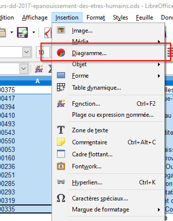
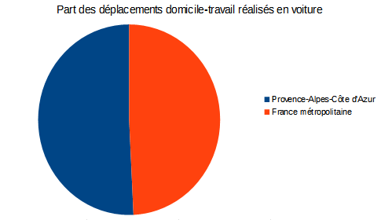
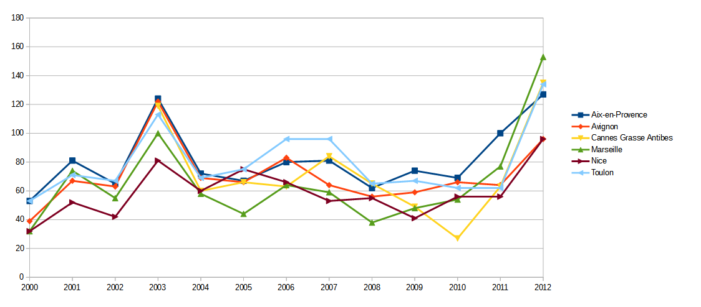

class: center, middle, inverse

# `r icon::fa("table", size = 1)` Opérations de base sous Excel ou LibreOffice
### Rappel de quelques fonctions utiles avant de commencer
---
Pour créer des graphiques sous Excel, on sélectionne la plage de données qui nous intéresse (avec les titres), si nécessaire en appuyant sur la touche Ctrl si les colonnes ou lignes sont disjointes, puis on va dans le menu `Insertion > Diagramme`.

Plusieurs sortes de diagrammes nous sont alors proposés : en barres, camemberts, séries temporelles, ...

---
class: center, middle, inverse
#Comparer PACA et France métropolitaine

`r icon::fa("chart-pie", size = 4)`

---
class:exo

`r icon::fa("file", size = 1)` Prendre le fichier : indicateurs de développement durable sur l'épanouissement des êtres humains

##Exo 10
&#9658; Comparer, sous forme de camembert, la situation de la région par rapport au territoire national pour ce qui est de :

- la part des déplacements domicile-travail effectués en voiture (%)

--

---
class:exo 

##Exo 11
&#9658; Comparer à présent sous la forme de graphiques en barres :

  - la part des actifs ayant un emploi travaillant dans leur commune de résidence (%)
  
  - la part des déplacements domicile-travail en transport en commun (%)
  
  - la part des déplacements domicile-travail effectués en voiture (%)
  
  - l'évolution du trafic international entrant des marchandises (base 100 en 2000)
  
  - la part des immatriculations de voitures neuves peu polluantes (%)
  
  - la part des véhicules diesel dans les immatriculations neuves (%)
  
  - la part de la population exposée au bruit du trafic routier (%)

---

---
class: center, middle, inverse
#Évolution temporelle

`r icon::fa("chart-area", size = 4)`

---
class:exo

##Exo 12
&#9658; Réaliser des graphiques en lignes qui montrent l'évolution, de 2000 à 2018, du nombre jours avec une qualité de l'air médiocre pour les agglomérations concernées de PACA

--

---
class: center, middle, inverse

# Corréler

`r icon::fa("chart-line", size = 4)`

---
class:exo

`r icon::fa("file", size = 1)` Prendre le fichier : Populations exposées au dépassement des valeurs de référence des PM10, NO2 et O3

##Exo 13 
- Existe-t-il un lien entre le nombre d'habitants et l'indicateur ISA ?

--

</img>
